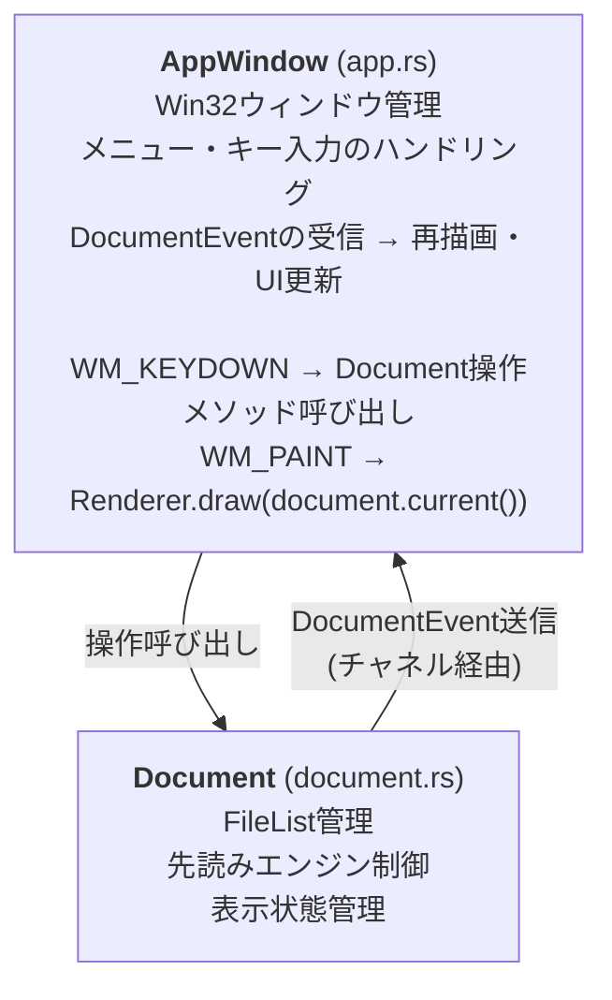
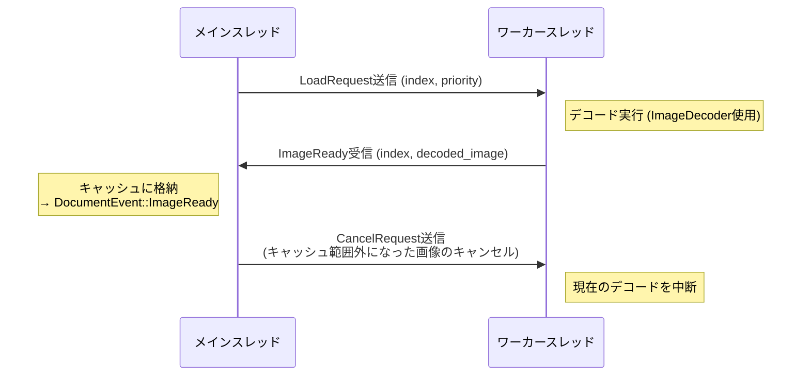

# アーキテクチャ

## アーキテクチャパターン: Model-View (MV) 分離

Win32メッセージベースのアプリケーションにはMVVMは過剰であるため、MV分離を採用する。



## 先読みエンジン設計

### リングバッファキャッシュ

```text
     ← 後方キャッシュ  現在  前方キャッシュ →
     [...] [...] [...] [表示中] [...] [...] [...]
      -3    -2    -1     0      +1    +2    +3
```

- キャッシュサイズ（前方N枚 + 後方M枚）は利用可能メモリに基づいて動的に決定
- ベースサイズ（デフォルト1024×1536）の画像を基準にキャッシュ可能枚数を計算
- メモリ予算方式を採用: 固定枚数ではなく、利用可能メモリから動的にキャッシュ枚数を算出することで、
  大画像でもOOM (Out of Memory) を回避

### ワーカースレッド



- `crossbeam-channel` でリクエストキューを実装
- 優先度付きロード: 現在ページ → 次ページ → 前ページ → 遠いページ
- ナビゲーション時に不要なリクエストをキャンセル（世代管理: リクエスト送信時の世代番号と
  現在の世代番号が一致しない場合、レスポンスを破棄）

### 背景コンテナ展開スレッドのI/O優先度制御

多数のZIPをまとめて開くと、残りのコンテナはバックグラウンド専用のrayonプールで順次展開される。
このプールには以下の制約を設けている。

- 並列度は1に固定する。
  HDD環境ではシーク競合が支配的で、並列展開するとフォアグラウンド操作のI/Oを阻害する。
  SSD環境でも1並列で十分高速なため、両者の最大公約数として1を選ぶ
- ワーカースレッドのI/O優先度とページ優先度をLowに下げる（`THREAD_MODE_BACKGROUND_BEGIN`）。
  これにより、同じ物理ディスクへのメインスレッド・先読みワーカーのI/Oが優先される
- 世代ごとのキャンセルフラグで旧rayonプールを停止できる。
  旧世代を破棄する処理はすべて共通メソッドを呼び、旧ジョブの残存I/Oを進行中の1件だけに抑える

## デコーダチェーン

デコーダはDecoderChainに登録された順で`can_decode()`を試行し、最初に対応したデコーダがデコードを担当する。
登録順は以下の通り。

1. StandardDecoder (`image` crate) — JPEG/PNG/GIF/BMP/WebP
2. SusieDecoder (`libloading`) — Susieプラグインからの動的登録

標準デコーダを優先することで、Susieプラグインがなくても主要フォーマットを確実にサポートする。

EXIFの向き情報（Orientation 1〜8、鏡像を含む）はStandardDecoderがデコード直後に画素へ一度だけ適用する。
通常読込・先読み・アーカイブ内画像はいずれもDecoderChainを経由するため同じ結果になり、
キャッシュ・描画・編集・出力は補正済みの画素をそのまま扱う。
他の処理で重ねて適用すると回転が累積するため、補正はStandardDecoderだけに置く。
PDFページとSusieプラグインの出力は補正の対象外とする。

## 描画資源の所有と復旧

D2DRendererは、レンダーターゲットと、そこから作成してキャッシュする資源
（通常画像のビットマップ、縮小済みビットマップ、チェッカーブラシ）を1つの所有単位にまとめる。
Direct2Dの資源は作成元のターゲットが失効すると使えなくなるため、所有単位ごと破棄して旧資源を残さない。

- `EndDraw`・`Resize`が`D2DERR_RECREATE_TARGET`を返したら所有単位を破棄する。
  `draw`は「再描画が必要」を返し、次の描画が初回と同じ手順でターゲットと資源を再作成する
- 表示倍率・α背景・パネル幅（描画オフセット）・直近の描画矩形は所有単位の外に置き、失効しても変わらない。
  画像・編集状態・選択範囲はDocumentとSelectionが持つため、復旧で画像を開き直さない
- AppWindowの`on_paint`は再描画を要求し、描画に成功しない回数が連続3回を超えたときと
  描画エラーのときはタイトルバーへ通知して自動の再描画要求を止める。
  利用者の操作（リサイズなど）による再描画で再試行し、成功したら描画エラーの表示を解除する
- 失効と作成失敗はテスト構成だけで有効な試験用の操作で発生させ、物理的なデバイス喪失を待たずに自動テストで検証する

## 設計上の制約・選択

- GIFは静止画のみ: アニメーションGIF対応は先読みキャッシュとの整合が複雑になるため意図的に除外
- 削除操作はごみ箱経由: ユーザーの誤操作によるデータ喪失を防ぐ安全設計
- 永続フィルタ: 通常のフィルタが現在の画像にのみ適用されるのに対し、永続フィルタは
  ナビゲーションしても全画像に自動適用される。一括処理（例: 全画像をグレースケールで閲覧）のための仕組み
- 選択範囲のナビゲーション跨ぎ保持: 確定済みの選択範囲は、ファイルリスト内を移動する
  ナビゲーション（前後移動・マーク間移動・フォルダ間移動・ページ指定移動など）では保持する。
  複数の画像から同一座標の領域を繰り返し指定する操作を、画像ごとの選択のやり直しなしに行うため。
  ファイルを開く・フォルダを開く・ドラッグ＆ドロップは別の作業の開始とみなして解除する
- 選択範囲の座標は切替時に補正しない: 切替先の画像より選択範囲が大きい場合も座標値をそのまま保持し、
  各処理が`PixelRect::clamped`で境界へ収めて扱う。切替のたびにクランプすると、
  小さい画像を経由しただけで選択範囲が縮小したまま戻らなくなるため
