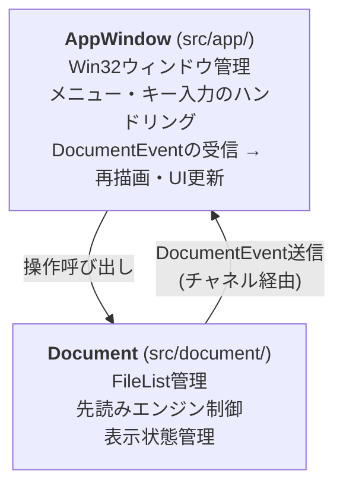
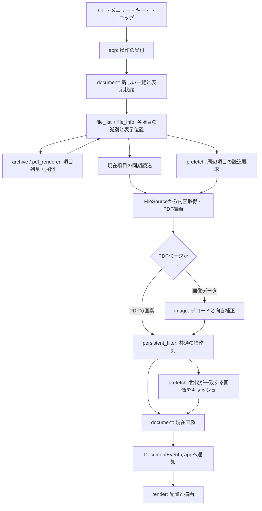
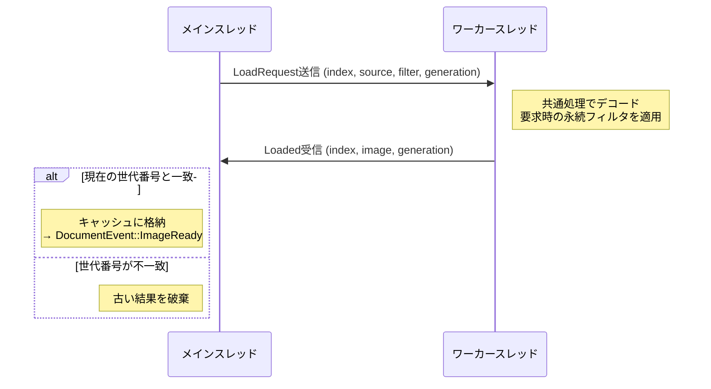

# アーキテクチャ

## アーキテクチャパターン: Model-View (MV) 分離

Win32メッセージベースのアプリケーションにはMVVMは過剰であるため、MV分離を採用する。



## アプリ層の分割と表示状態

`app/mod.rs`はAppWindowの生成、Win32メッセージの受信、タイトルとエラー通知、
モーダル操作の準備・終了、描画とリサイズ、Actionの振り分けを持つ。
操作の実装はマーク、開閉、ブックマーク、情報表示、マウス、画像出力などの分野ごとに
`app/`のサブモジュールへ置き、Actionの各分岐は操作メソッドの呼出しにする。
出力形式とエンコーダは`app/export.rs`、ウィンドウテスト支援は`app/test_support.rs`へ置く。
Shellのファイル操作は`shell/file_operations.rs`、コモンダイアログは`ui/file_dialog.rs`が担当する。

`app/dispatch.rs`のWindowStateがAppWindowを所有し、RefCellで同期再入時の借用を管理する。
モーダル処理と同期Win32操作は所有値で保持し、アプリの借用終了後に実行する。
モーダル中も親の描画とリサイズは処理し、文書イベントは結果適用後へ保留する。
ListViewの表示情報は通知中に応答し、通知ポインターを保留キューへ渡さない。
親の破棄後はUI操作とモーダル結果の適用を中止し、所有者は同期処理の終了まで保持する。

パネルはF4で選ぶ表示希望とListViewへ適用する実表示を分ける。
フルスクリーン中は表示希望を保持したまま実表示を非表示にし、
パネル幅と画像の描画オフセットは実表示を参照する。
F4とフルスクリーンの切替後は実クライアントサイズから再配置し、偽のWM_SIZEを送らない。
`menu_visible`も通常表示への復帰時に使う表示希望であり、フルスクリーン中の実表示ではない。

## モジュール構成

`app`が操作を受けて`document`へ渡し、`document`がファイル一覧と画像の状態を所有する。
`render`と`ui`はその状態を表示する。読込側は描画側へ依存しない。

| モジュール           | 役割                                                                     |
| -------------------- | ------------------------------------------------------------------------ |
| `main`               | CLI分岐、プロセス初期化、ウィンドウとメッセージループの起動              |
| `app`                | 操作の受付、Documentの操作、描画とUIの更新                               |
| `document`           | 開いている一覧・コンテナー・画像・編集の状態と、読込・先読み・展開の調整 |
| `file_info`          | 実ファイル・アーカイブ項目・PDFページ・未展開コンテナーの識別と属性      |
| `file_list`          | 一覧の順序、グループ、マーク、表示位置の管理                             |
| `prefetch`           | 読込要求、ワーカー、世代管理、画像キャッシュ                             |
| `archive`            | 各形式の項目列挙、内容取得、一時展開とSusieアーカイブへの接続            |
| `image`              | デコーダチェーン、標準画像とSusie画像のデコード、EXIF情報の取得          |
| `pdf_renderer`       | PDFページの列挙と画像への描画                                            |
| `susie`              | プラグインの探索・所有とFFIの境界                                        |
| `render`             | 表示倍率と配置、Direct2D描画資源の所有・復旧                             |
| `ui`                 | ウィンドウ、メニュー、キー設定、パネル、フォームと各ダイアログ           |
| `action`             | キー・メニューから呼び出す操作の識別                                     |
| `help`               | 設定と対応形式を使ったGUI・CLI共通ヘルプの生成                           |
| `extension_registry` | 標準・アーカイブ・PDF・ブックマーク・Susieの対応拡張子                   |
| `filter`             | 画像の画素変換                                                           |
| `filter_spec`        | フィルターの種類、操作との対応、パラメーターと入力検証                   |
| `persistent_filter`  | 画像を切り替えても適用する操作列と、その設定状態                         |
| `selection`          | 画像座標の矩形選択と境界補正                                             |
| `bookmark`           | 一覧と表示位置の保存・復元、旧形式の読込                                 |
| `clipboard`          | クリップボードの画像と文字列の受け渡し                                   |
| `shell`              | 関連付け・エクスプローラー連携とShell経由のファイル操作                  |
| `config`             | 設定値と既定値、設定読込                                                 |
| `paths`              | 実行ファイルを基準とした設定・プラグイン等の場所の解決                   |
| `temp_cleanup`       | 一時資源の生成・命名と、所有プロセス終了後の回収                         |
| `updater`            | 更新確認、取得、終了後の実行ファイル置換                                 |
| `util`               | ファイル名や文字列の共通変換                                             |
| `test_helpers`       | テスト専用の画像入力と、寿命に対応する一時資源の所有                     |

アプリ層のサブモジュールは操作の分野ごとに置く。
`app/mod.rs`にはウィンドウの骨組みと操作の振り分けを置き、マーク、開く操作、
ブックマーク、画像情報、マウス、編集、保存などの本体は各サブモジュールへ置く。
構成を変えるときは、この章と次のデータの流れも実装へ合わせる。

## データの流れ



現在項目と先読みは同じ内容取得とデコードを使う。
この流れのデコード対象は通常ファイル・アーカイブ内画像・PDFページである。
未展開コンテナーを表す`PendingContainer`は次の「コンテナーの展開」で説明する背景処理を待つ。
PDFは既に画素になったページを使い、標準画像のデコーダへ渡さない。
新しい一覧を開くと旧展開・受信・キャッシュ・編集状態を破棄し、古い結果が新一覧に入らないようにする。
コンテナーの展開は画像の先読みとは別の仕事で、「コンテナーの展開」で所有とI/Oの扱いを説明する。

## 先読みエンジン設計

### リングバッファキャッシュ

```text
     ← 後方キャッシュ  現在  前方キャッシュ →
           [...] [...] [表示中] [...] [...] [...] [...]
            -2    -1      0      +1    +2    +3    +4
```

- 前方4枚・後方2枚を上限に、メモリ予算でキャッシュする枚数を決める
- ベースサイズ（デフォルト1024×1536）の画像を基準にキャッシュ可能枚数を計算
- メモリ予算方式を採用: 固定枚数ではなく、利用可能メモリから動的にキャッシュ枚数を算出することで、
  大画像でもOOM (Out of Memory) を回避

### ワーカースレッド



- `crossbeam-channel` でリクエストキューを実装
- 優先度付きロード: 現在ページ → 次ページ → 前ページ → 遠いページ
- 一覧や読込条件の変更時は世代を進め、現在の世代と一致しない要求と結果を破棄する。
  実行中のデコードを強制的に中断する機構ではない

## コンテナーの展開

ZIPは項目一覧とバッファを取得し、画像を必要な時点で直接読み込む。
RAR・7z・Susieアーカイブは一時ディレクトリへ展開する。
PDFはページ一覧を作成し、表示・先読み時にページを画像へ描画する。

同期読み込みと先読みは`image::decode_source`を使い、`FileSource`から内容と元のファイル名を取得する。
`PendingContainer`は展開前の一覧項目であり、`decode_source`へ渡さない。
Documentの`load_current`はその項目の背景展開を優先し、表示を読み込み中にする。
`process_expand_results`は現在世代の展開結果を一覧へ反映した場合だけ、表示位置を調整してキャッシュを無効化する。
その場合、保留中の移動先を解決できて現在項目があれば`load_current`を再実行する。
移動先の解決後の再読み込みが不要な場合は`schedule_prefetch`で先読みを再登録する。
PDFの同期描画はMTAスレッドで行い、STAで待機しない。
ZIPの列挙・番号指定取得は`ArchiveHandler`を通す。展開済みアーカイブ画像の実パスはソースが保持する。
先読みの永続フィルタは要求時の設定をワーカーで適用し、受信側は適用済み画像を格納する。

新しい一覧を開くときは、背景展開の取消・受信口・世代・進捗・展開先・ZIP保持・キャッシュを共通処理で初期化する。
編集状態はDocumentの真偽値で保持し、画像の読み込み時に解除する。編集前画像の別コピーは保持しない。

### 背景コンテナ展開スレッドのI/O優先度制御

多数のZIPをまとめて開くと、残りのコンテナはバックグラウンド専用のrayonプールで順次展開される。
このプールには以下の制約を設けている。

- 並列度は1に固定する。
  HDD環境ではシーク競合が支配的で、並列展開するとフォアグラウンド操作のI/Oを阻害する。
  SSD環境でも1並列で十分高速なため、両者の最大公約数として1を選ぶ
- ワーカースレッドのI/O優先度とページ優先度をLowに下げる（`THREAD_MODE_BACKGROUND_BEGIN`）。
  これにより、同じ物理ディスクへのメインスレッド・先読みワーカーのI/Oが優先される
- 世代ごとのキャンセルフラグで旧rayonプールを停止できる。
  旧世代を破棄する処理はすべて共通メソッドを呼び、旧ジョブの残存I/Oを進行中の1件だけに抑える

## デコーダチェーン

デコーダはDecoderChainに登録された順で`can_decode()`を試行し、最初に対応したデコーダがデコードを担当する。
登録順は以下の通り。

1. StandardDecoder (`image` crate) — JPEG/PNG/GIF/BMP/WebP
2. SusieDecoder (`libloading`) — Susieプラグインからの動的登録

標準デコーダを優先することで、Susieプラグインがなくても主要フォーマットを確実にサポートする。

EXIFの向き情報（Orientation 1〜8、鏡像を含む）はStandardDecoderがデコード直後に画素へ一度だけ適用する。
通常読込・先読み・アーカイブ内画像はいずれもDecoderChainを経由するため同じ結果になり、
キャッシュ・描画・編集・出力は補正済みの画素をそのまま扱う。
他の処理で重ねて適用すると回転が累積するため、補正はStandardDecoderだけに置く。
PDFページとSusieプラグインの出力は補正の対象外とする。

## 描画資源の所有と復旧

D2DRendererは、レンダーターゲットと、そこから作成してキャッシュする資源
（通常画像のビットマップ、縮小済みビットマップ、チェッカーブラシ）を1つの所有単位にまとめる。
Direct2Dの資源は作成元のターゲットが失効すると使えなくなるため、所有単位ごと破棄して旧資源を残さない。

- `EndDraw`・`Resize`が`D2DERR_RECREATE_TARGET`を返したら所有単位を破棄する。
  `draw`は「再描画が必要」を返し、次の描画が初回と同じ手順でターゲットと資源を再作成する
- 表示倍率・α背景・パネル幅（描画オフセット）・直近の描画矩形は所有単位の外に置き、失効しても変わらない。
  画像・編集状態・選択範囲はDocumentとSelectionが持つため、復旧で画像を開き直さない
- AppWindowの`on_paint`は再描画を要求し、描画に成功しない回数が連続3回を超えたときと
  描画エラーのときはタイトルバーへ通知して自動の再描画要求を止める。
  利用者の操作（リサイズなど）による再描画で再試行し、成功したら描画エラーの表示を解除する
- 失効と作成失敗はテスト構成だけで有効な試験用の操作で発生させ、物理的なデバイス喪失を待たずに自動テストで検証する

## 設計上の制約・選択

- GIFは静止画のみ: アニメーションGIF対応は先読みキャッシュとの整合が複雑になるため意図的に除外
- 削除操作はごみ箱経由: ユーザーの誤操作によるデータ喪失を防ぐ安全設計
- 永続フィルタ: 通常のフィルタが現在の画像にのみ適用されるのに対し、永続フィルタは
  ナビゲーションしても全画像に自動適用される。一括処理（例: 全画像をグレースケールで閲覧）のための仕組み
- 選択範囲のナビゲーション跨ぎ保持: 確定済みの選択範囲は、ファイルリスト内を移動する
  ナビゲーション（前後移動・マーク間移動・フォルダ間移動・ページ指定移動など）では保持する。
  複数の画像から同一座標の領域を繰り返し指定する操作を、画像ごとの選択のやり直しなしに行うため。
  ファイルを開く・フォルダを開く・ドラッグ＆ドロップは別の作業の開始とみなして解除する
- 編集済み画像からの切り替えでは選択範囲を解除する。未編集画像の確定済み選択範囲は、
  スライドショーと一覧パネルからの移動でも保持する。ページ指定のキャンセルでは編集と選択を維持する
- 選択範囲の座標は切替時に補正しない: 切替先の画像より選択範囲が大きい場合も座標値をそのまま保持し、
  各処理が`PixelRect::clamped`で境界へ収めて扱う。切替のたびにクランプすると、
  小さい画像を経由しただけで選択範囲が縮小したまま戻らなくなるため
